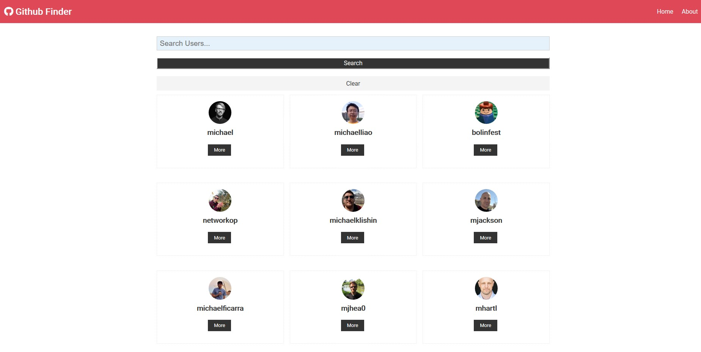

# ml-github-finder

This is my continuation in attempting to master React by implementing Hooks and Context APIs. This website will allow you to search Github users, display the results and view the Github user's information. 

## Technologies Used

- React Fundamentals (Components, props, state, etc)
- React Hooks (useState, useEffect, useContext, useReducer)
- Context API and App Level State

## What you would like to implement in the future

I would like to add a couple more things to the functionality:

- Being able to search other things on Github other than just the user so I will have to use different Github APIs
